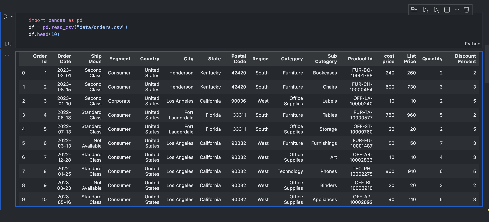
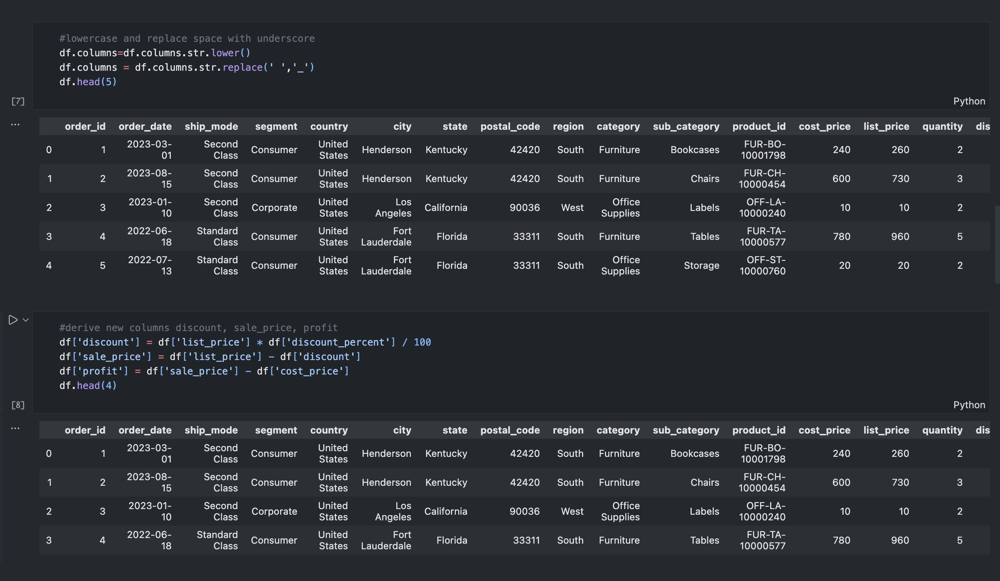
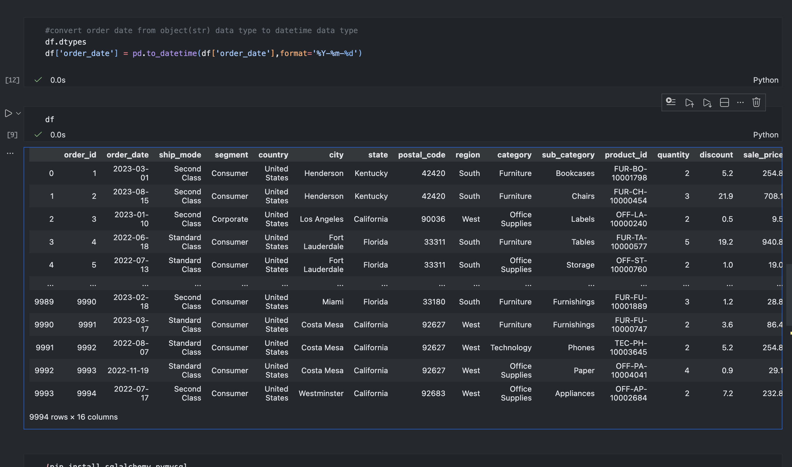
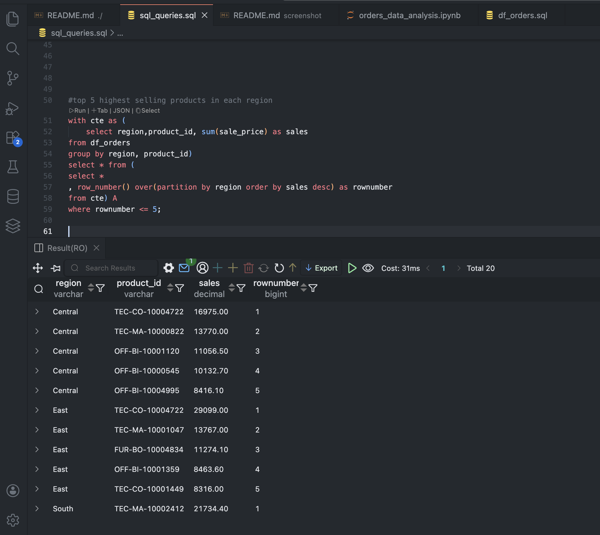
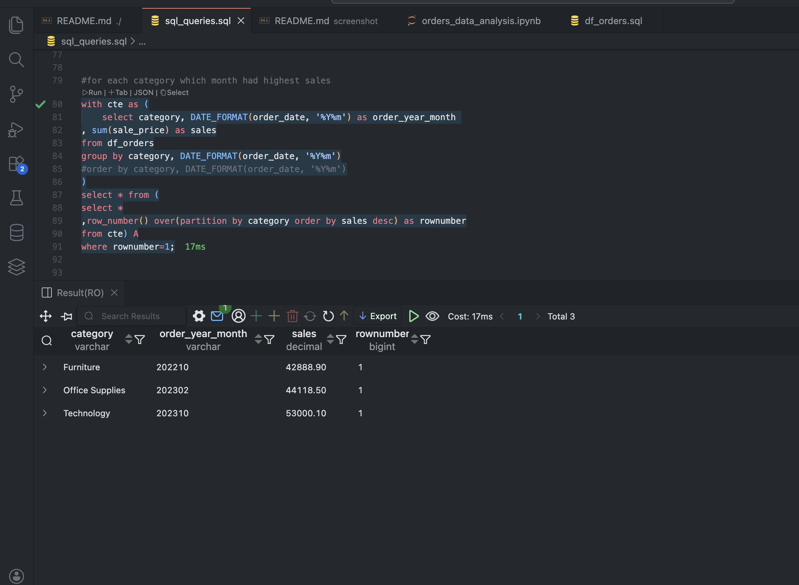
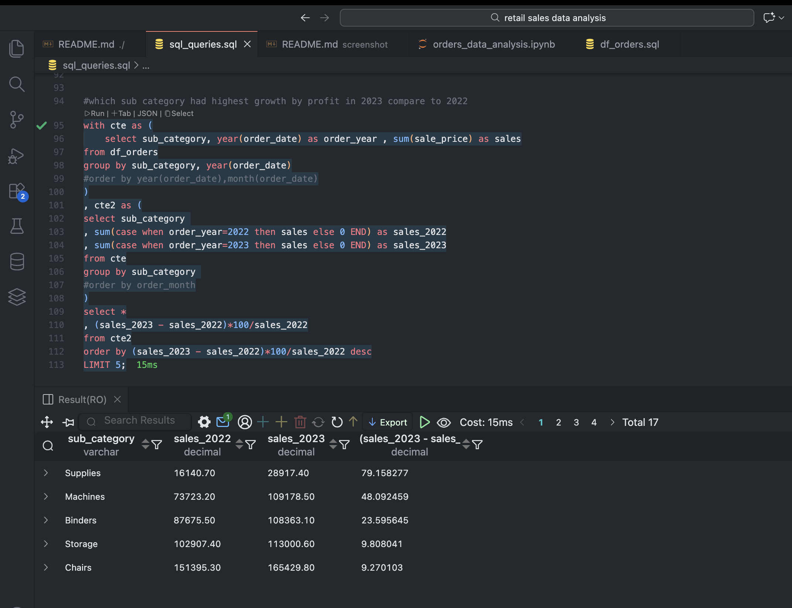

# Retail Sales Data Analysis Using Python, Pandas & SQL

## Project Overview

This project demonstrates an end-to-end data analytics workflow using Python, Pandas, MySQL, and SQLAlchemy.

The objective was to clean, transform, and analyze a retail orders dataset to generate meaningful business insights.

## Dataset

* Source: Kaggle Retail Orders Dataset
* Downloaded using the Kaggle API
* Contains order information, customer details, product categories, sales, discounts, and profits

## Tools & Technologies

* Python
* Pandas
* MySQL
* SQLAlchemy
* Kaggle API
* Jupyter Notebook
* VS Code
* GitHub

## ETL Process

### Extract

* Downloaded dataset from Kaggle using the Kaggle API.

### Transform

* Loaded dataset into Pandas.
* Removed duplicates.
* Handled missing values.
* Converted date columns to datetime format.
* Cleaned and prepared data for analysis.

### Load

* Connected Python to MySQL using SQLAlchemy.
* Loaded cleaned data into a MySQL database.

## SQL Analysis Performed

### 1. Top Revenue Generating Products

Identified products generating the highest sales revenue.

### 2. Monthly Sales Analysis

Analyzed sales performance across different months.

### 3. Category-wise Sales Performance

Compared sales across product categories.

### 4. Regional Analysis

Evaluated sales performance by region.

### 5. Profitability Analysis

Analyzed profit contribution across products and categories.

## Key Skills Demonstrated

* Data Cleaning
* Data Transformation
* ETL Workflow
* SQL Querying
* Business Data Analysis
* Python Programming
* Database Management

## Project Outcome

Successfully built a complete analytics pipeline from data extraction to business insight generation using Python and SQL.

## Screenshots

  
  

  
  

  
  

